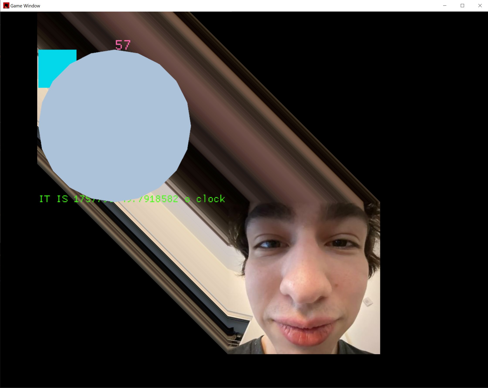
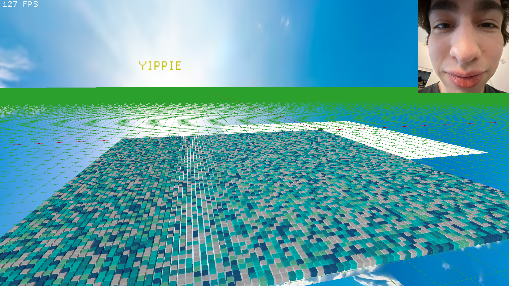

# Pyquad

This is a Python abstraction for the Rust engine [macroquad](https://github.com/not-fl3/macroquad).

The project is in early development and the repository exists for documentation purposes.

Featuring 2D:  

Featuring 3D:  

How to build:

1) Create and activate a python virtual enviroment.

2) Run `maturin build --release`

3) The .whl file can be found at `./target/wheels/`

4) The .whl file can be added to pip via `pip install C:\path\to\your\file.whl --force-reinstall`